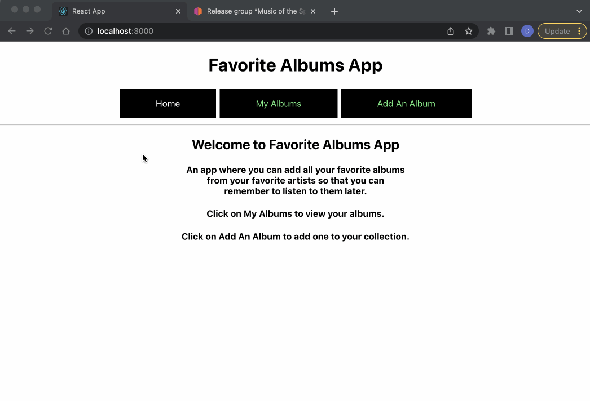

# Favorite Albums App

## Overview
>A single page application using client-side routing to let a user add their favorite albums to a collection.

## App Philosophy

The target audience of this app is any music fanatic that enjoys collecting albums to listen to. This app will help the user keep track of their favorite albums by adding them to a collection. They can reference the collection later to help them remember which albums to listen to.

## Features

* Add a new album to your collection, including its title, its artist, its album artwork, and a personal rating
* View a list of your collection of albums

## Requirements
* Node 16.9.0
* json-server

## Installation

On your terminal, change the current working directory to where you want the cloned directory to live. Copy the URL for this repository. Then type `git clone` into your terminal and paste the URL.

```bash
$ git clone https://github.com/guzdaniel/favorite-albums-app.git
```

Navigate to the app directory and use npm install to install required dependencies.

```bash
npm install 
```


## Usage

In the same directory, use npm start to run the server and the app.

```bash
npm start
```
Open in localhost:3000 in your browser.

>``http://localhost:3000``

## Technologies Used

This Single Page Application was made using:
- Javascript
- React
- react-router-dom@5 (version 5)
- styled-components
- CSS
- json-server
- [MusicBrainz Album Artworks](https://musicbrainz.org/)

---

## How To Use



---

## MIT License


Copyright (c) <2022> Daniel Guzman

Permission is hereby granted, free of charge, to any person obtaining a copy
of this software and associated documentation files (the "Software"), to deal
in the Software without restriction, including without limitation the rights
to use, copy, modify, merge, publish, distribute, sublicense, and/or sell
copies of the Software, and to permit persons to whom the Software is
furnished to do so, subject to the following conditions:

The above copyright notice and this permission notice shall be included in
all copies or substantial portions of the Software.

THE SOFTWARE IS PROVIDED "AS IS", WITHOUT WARRANTY OF ANY KIND, EXPRESS OR
IMPLIED, INCLUDING BUT NOT LIMITED TO THE WARRANTIES OF MERCHANTABILITY,
FITNESS FOR A PARTICULAR PURPOSE AND NONINFRINGEMENT. IN NO EVENT SHALL THE
AUTHORS OR COPYRIGHT HOLDERS BE LIABLE FOR ANY CLAIM, DAMAGES OR OTHER
LIABILITY, WHETHER IN AN ACTION OF CONTRACT, TORT OR OTHERWISE, ARISING FROM,
OUT OF OR IN CONNECTION WITH THE SOFTWARE OR THE USE OR OTHER DEALINGS IN
THE SOFTWARE.


